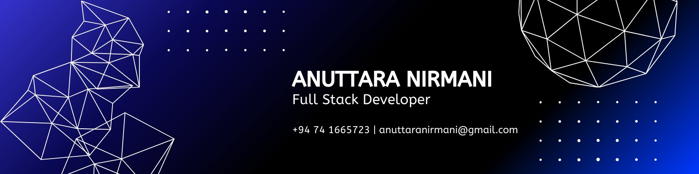
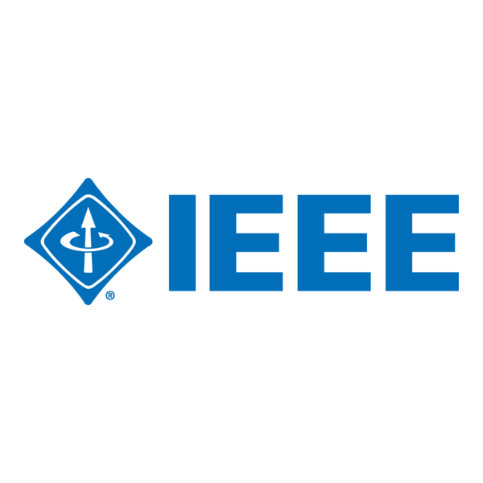
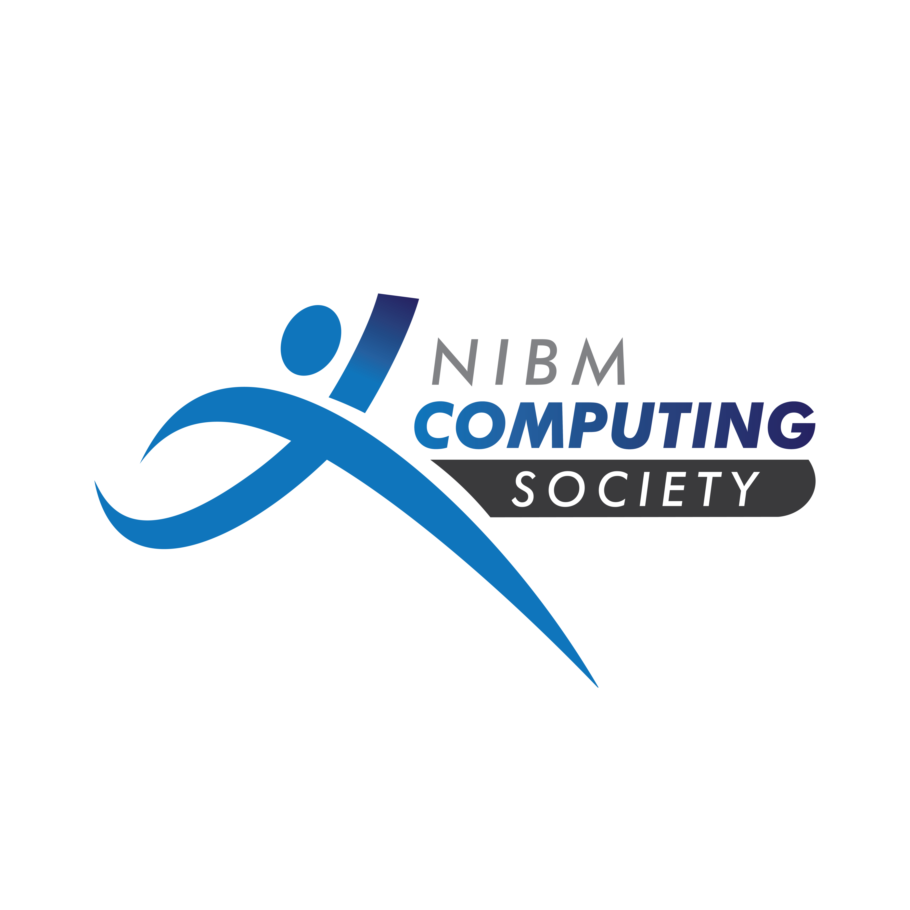
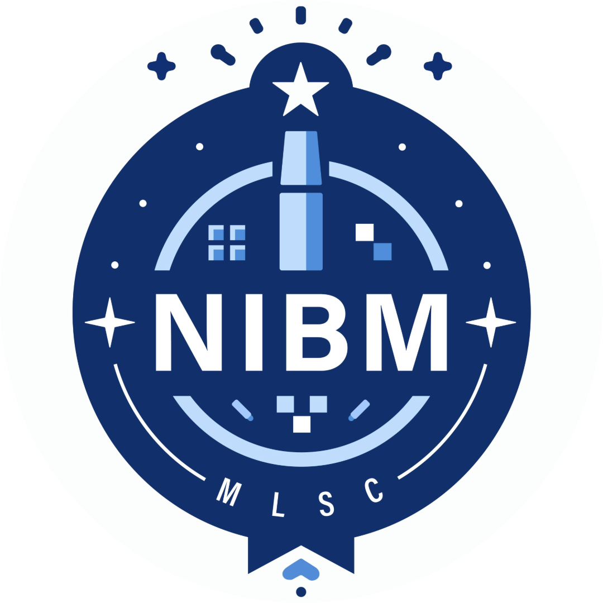

    

<h1 align="center">Hello 👋, I'm Anuttara Nirmani</h1>
<h3 align="center">A Full Stack Developer mainly passionate about Frontend 🚀</h3>

---

- 🔭 I’m currently working on **Wijeya Newspapers Ltd**
- 🌱 I’m currently learning **AL & ML**
- 👯 I’m looking for oppertutinies as a **Frontend Developer**
- 💬 Ask me about **Flutter**
- ⚡ BTW **I'm a solo traveller**

---

### 📫 Connect with Me:

  
  
  

---

### 🛠 My Tech Stack:

  <!-- Row 1 -->
  
  
  
  
  

  <!-- Row 2 -->
  
  
  
  
  

  <!-- Row 3 -->
  
  
  

  <!-- Row 4 -->
  
  
  
  

  <!-- Row 5 -->
  
  

  <!-- Row 6 -->
  
  
  
  
  
  

---

### 🌍 Volunteering For:

  <a href="https://linkedin.com/in/anuttara-nirmani"></img></a>
<a href="https://linkedin.com/in/anuttara-nirmani"></img></a>
<a href="https://linkedin.com/in/anuttara-nirmani"></img></a>

---

### 💯 Statistics:

---

### 🔥 GitHub Contribution Graph:

  

---
